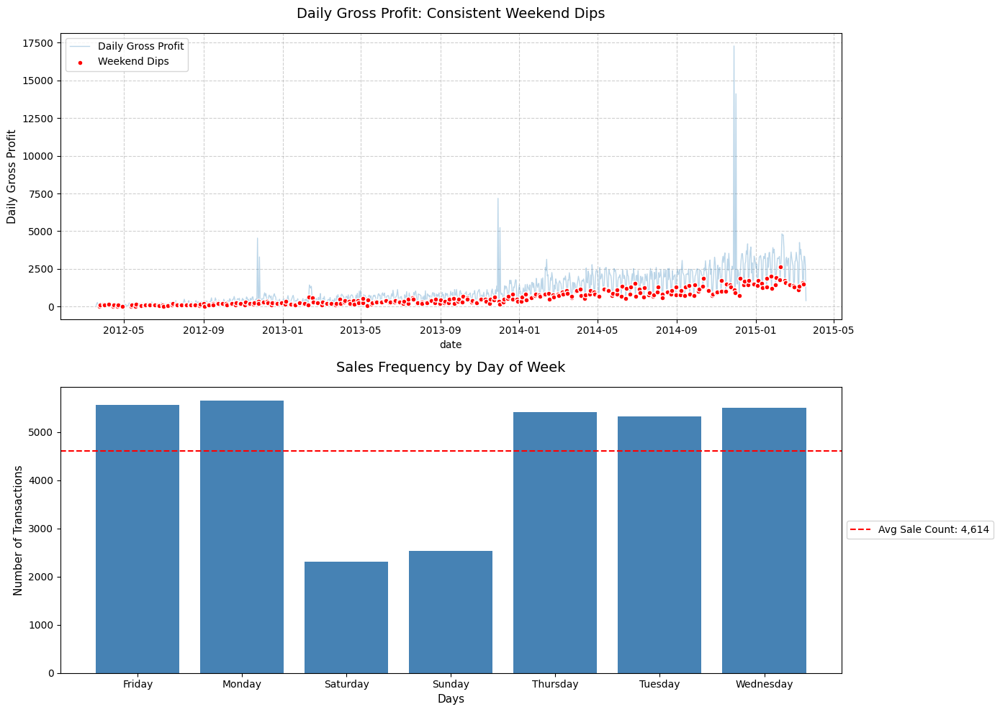
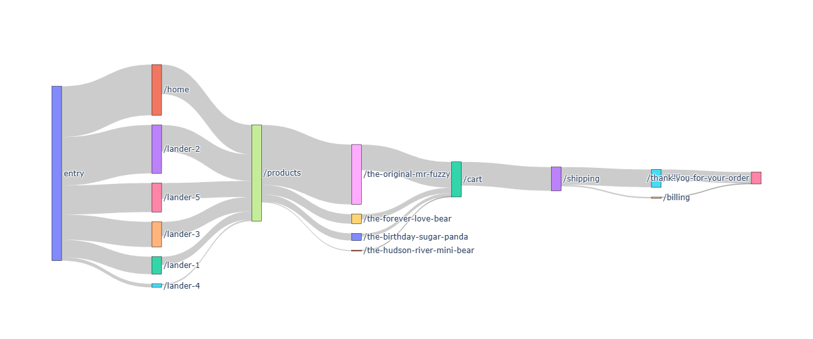
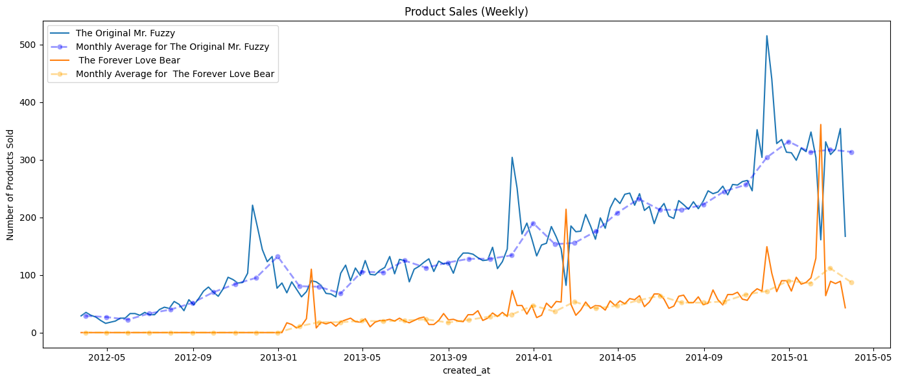

# Strategic Growth Opportunities: A Diagnostic Analysis of Maven Fuzzy Factory’s E-Commerce Performance (2012–2015)
Analyzing 3 years of sales records with 30k+ orders and 470k+ sessions to identify growth opportunities for an e-commerce business.

## 📖 Table of Contents
- [Overview](#overview)
- [Problem Statement](#problem-statement)
- [Data Source](#data-source)
- [Tools & Technologies](#tools--technologies)
- [Methodology](#methodology)
- [Key Findings & Insights](#key-findings--insights)
- [Visualization Gallery](#visualization-gallery)
- [Next Steps](next-steps)
- [Conclusion](#conclusion)
- [Contact](#contact)

---

## Overview
This project analyzes a database entailing order records, session metadata, and website analytics to optimize revenue acquisition. The goal is to find room for optimization based on trends and make actionable insights that can help stakeholders make data-driven decisions regarding their future strategies.

## 🎯 Problem Statement
The core challenge addressed in this analysis is:
> Maven Fuzzy Factory is scaling its e-commerce operations and recognizes the need to better understand its business landscape. With transactional and site traffic data spanning 2012–2015, the company seeks to conduct an exploratory diagnostic analysis to uncover patterns, trends, and potential opportunities.

**Objectives:**
- Explore revenue and traffic trends to identify patterns and anomalies in the data.
- Generate hypotheses for deeper investigation or future analysis.
- Provide recommendations to improve sales.

## 📂 Data Source
The dataset used for this analysis was obtained from [Maven Analytics](https://mavenanalytics.io/).
- **Date Range:** March 19th 2012 to March 19th 2015
- **Record Count:**
   - orders_df: 32313
   - order_items_df: 40025
   - sessions_df: 472871
   - pageviews_df: 1188124
 
- **Columns:** [Number] features (e.g., `customer_id`, `transaction_date`, `revenue`, `region`)
  - orders_df: 8 features: `order_id`, `created_at`, `website_session_id`, `user_id`, `primary_product_id`, `items_purchased`, `price_usd`, `cogs_usd`
  - order_items_df: 7 features: `order_item_id`, `created_at_id`, `order_id`, `product_id`, `is_primary_item`, `price_usd`, `cogs_usd`
  - sessions_df: 9 features: `website_session_id`, `created_at`, `user_id`, `is_repeat_session`, `utm_source`, `utm_campaign`, `utm_content`, `device_type`, `http_referrer`
  - pageviews_df: 4 features: `website_pageview_id`, `created_at`, `website_session_id`, `pageview_url`

*Note: The raw data has been cleaned and pre-processed. See the [Methodology](#methodology) section for details.*

## 🛠 Tools & Technologies
- **Data Extraction/Storage:** Python | Pandas
- **Data Cleaning:** Python | Pandas | Numpy
- **Exploratory Data Analysis (EDA):** Jupyter Notebooks / Kaggle Notebooks
- **Visualization & Dashboarding:** Matplotlib | Seaborn | Plotly

## 🔍 Methodology
This analysis followed a standard data analytics pipeline:

1. **Data Extraction & Loading:** Data was downloaded from Maven Analytics website and loaded into Kaggle.
2. **Data Cleaning:**
   - The dataset has no need for extensive cleaning as the integrity and usability is proper.
   - Standardized date formats for all `created_at` columns.
3. **Exploratory Data Analysis (EDA):**
   - Used line charts to identify trends in revenue, conversions, and traffic.
   - Used Sankey diagram to identify traffic paths/customer journey.
   - Used `pd.DataFrame.groupby()` to aggregate data and understand trends.
   - Used stacked area charts to compare product sales and traffic by channel over time.
4. **Feature Engineering:**
   - Created new metrics such as:
     - conversion rates
     - end-of-week sales aggregation
     - journey map label
     - QoQ growth
6. **Visualization:** Built charts and visuals to highlight key trends (refer to gallery).

## 💡 Key Findings & Insights
Based on the analysis, the following insights were discovered:

- **Insight 1:** Weekend-Weekday Traffic Gap – Maven Fuzzy Factory has significantly lesser traffic during weekends compared to weekdays, while maintaining similar conversion rates. This leads to weekly sales dips and signals lost opportunities for the business. While QoQ shows steady growth throughout the 3-year period, the gap between weekend sales and weekday sales are widening. Optimizing weekend traffic to scale with weekday sales  by even 10% has the potential to increase yearly revenue by over USD13k.
- **Insight 2:** Consolidated Products Portfolio – Maven Fuzzy Factory's product line are consolidated into 2; collectibles and commemorative plushies. 3 of the products have similar price band. The similarities will be appeal to narrower segments when the business could offer more segmentation to cater to customers' interests.
- **Insight 3:** Constrained Product Visibility – Despite the consolidated product portfolios, `The Original Mr. Fuzzy` is the most popular item, accounting for more than half of the sales. This raises a concern that other products are overshadowed by the `The Original Mr. Fuzzy`.
- **Insight 4:** Lack of Seasonality – On top of the visibility concerns and consolidated products portfolio, there is a concern for future losses in the next seasonal cycle. Analysis shows that `The Original Mr. Fuzzy`'s sales drops by almost half on Valentine's day, while `The Forever Love Bear` sales spikes by three times their typical sales. Currently, `The Original Mr. Fuzzy`'s losses are covered by `The Forever Love Bear`'s sales, but the coverage are decreasing due to `The Forever Love Bear`'s sales are unable to scale with `The Original Mr. Fuzzy`.

## 📊 Visualization Gallery
*Below are key screenshots from the analysis.*

*Figure 1: Weekend sales dip and orders placed by day of week.*

*Figure 2: Overview of customer traffic for 2013-2015.*

*Figure 3: Line chart for `The Forever Love Bear` and `The Original Mr. Fuzzy` .*

## Next Steps
1. **Marketing Campaign Expansion:**
   - Referral campaigns for future discounts and coupons will expand data maturity for future analysis, while also expanding the customer base. This action has the potential to increase traffic and retention, enable geospatial analysis for customer segmentation, supports future R&D, and opens the door for an email marketing campaigns.
   - Expanding the marketing channels to social media platforms can increase visibility, as social media platforms have a high traffic density daily. This will help bridge the gap between weekend and weekday traffic.
   - Discount campaigns or flash sales will also increase traffic and sales.
2. **Launching Purposeful Products:**
   - There are two possible paths for the next products; commemorative items with seasonality appeal and day-to-day items that's reliably in-demand.
   - Commemorative items with seasonality like `The Forever Love Bear` have the potential to create a healthier products portfolio that brings additional profit. For example; expanding this product segment to Easter-themed, Lunar New Year-themed, and/or Christmas-themed can introduce new sales spikes for additional revenue.
   - Day-to-day items like `The Original Mr. Fuzzy` have the potential to be a reliable sales driver and compete all-year. This product segment's purpose is to drive retention up and pull customers for repeat purchases.
3. **Investigate Web Design:**
   - Ensure all products have an equal chance of being selected by customers and verify `The Original Mr. Fuzzy`'s popularity is customer driven, not influenced by the web design.
  
## Conclusion
This analysis implies that Maven Fuzzy Factory has demonstrated steady growth over three years with a reliable customer acquisition funnel across all channels. However, the business has clear optimization opportunities that can unlock further growth. By applying fresh strategies to attract more customers into the website, this business will be able to grow their revenue even further. 

## 📬 Contact
For further questions regarding this analysis or to discuss potential implementation strategies:

- **Email:** mhaikalazman00@gmail.com
- **GitHub:** https://github.com/mhaikalazman00-dev
